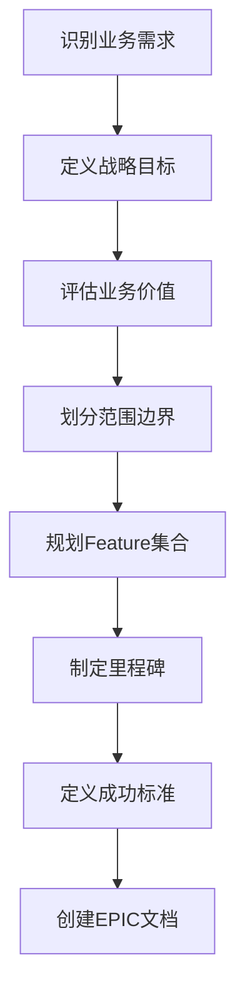
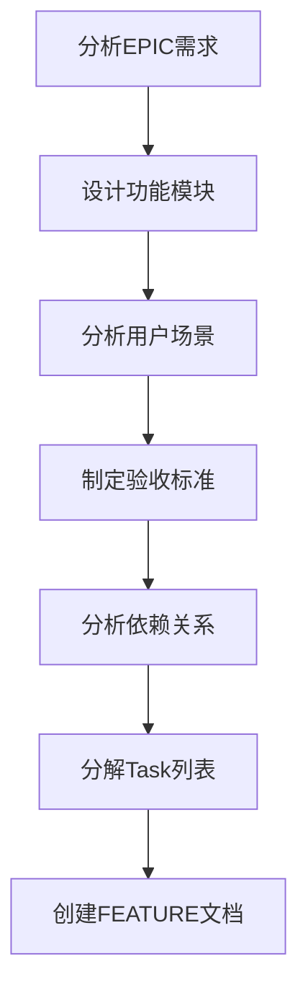
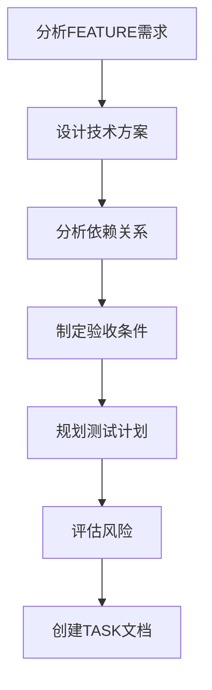

# 📚 EPIC-FEATURE-TASK 标准化提示词模板索引

## 📋 概述

本文档提供了基于 EPIC-FEATURE-TASK 三层结构的标准化提示词模板集合，用于确保项目管理和开发过程的一致性和高效性。

## 🎯 模板架构

```
EPIC (史诗)
├── 战略目标定义
├── 业务价值评估
├── 范围边界划分
└── Feature 集合
    │
    FEATURE (功能特性)
    ├── 功能模块设计
    ├── 用户场景分析
    ├── 验收标准制定
    └── Task 分解
        │
        TASK (具体任务)
        ├── 技术实现方案
        ├── 依赖关系分析
        └── 验收条件定义
```

## 📖 模板清单

### 🚀 EPIC 模板
- **文件**: <mcfile name="epic_template.md" path="c:\Users\yangjh\Desktop\ap\dev\00-specs\epic_template.md"></mcfile>
- **用途**: 创建大型功能集合的战略规划文档
- **核心要素**:
  - 📊 **战略目标**: 业务目标、技术目标、用户价值
  - 💰 **业务价值**: 价值量化、风险评估、ROI预估
  - 🎯 **范围边界**: 包含范围、不包含范围、依赖关系
  - 🗺️ **Feature映射**: 核心Feature、可选Feature
  - 📅 **里程碑规划**: 分阶段实施计划
  - ✅ **成功标准**: 功能标准、质量标准、业务标准

### 🎯 FEATURE 模板
- **文件**: <mcfile name="feature_template.md" path="c:\Users\yangjh\Desktop\ap\dev\00-specs\feature_template.md"></mcfile>
- **用途**: 创建独立功能模块的详细设计文档
- **核心要素**:
  - 🎯 **功能模块**: 核心功能、功能边界、技术架构
  - 👥 **用户场景**: 目标用户、用户故事、使用场景
  - ✅ **验收标准**: 功能验收、技术验收、测试验收
  - 🔗 **依赖关系**: 前置依赖、后续影响
  - 📋 **Task分解**: 设计、开发、测试、部署阶段
  - 📊 **进度跟踪**: 当前状态、风险评估、成功指标

### ⚡ TASK 模板
- **文件**: <mcfile name="task_template.md" path="c:\Users\yangjh\Desktop\ap\dev\00-specs\task_template.md"></mcfile>
- **用途**: 创建具体开发任务的技术实现文档
- **核心要素**:
  - 🎯 **任务描述**: 任务目标、背景说明、预期产出
  - 🔧 **技术实现**: 技术方案、实现细节、代码结构
  - 🔗 **依赖关系**: 前置依赖、后续影响
  - ✅ **验收条件**: 功能验收、代码质量、测试验收
  - 🧪 **测试计划**: 单元测试、集成测试、性能测试
  - 🚨 **风险评估**: 技术风险、时间风险、依赖风险
  - 📊 **进度跟踪**: 当前状态、工作日志、阻塞问题

## 🔧 使用指南

### 📝 创建流程

#### 1️⃣ EPIC 创建流程


#### 2️⃣ FEATURE 创建流程


#### 3️⃣ TASK 创建流程


### 🎯 最佳实践

#### EPIC 层面
- ✅ **战略对齐**: 确保EPIC与公司/项目整体战略保持一致
- ✅ **价值驱动**: 明确量化的业务价值和ROI预期
- ✅ **范围控制**: 清晰定义包含和不包含的功能范围
- ✅ **里程碑管理**: 设置可验证的阶段性目标
- ✅ **风险管控**: 识别并制定风险缓解措施

#### FEATURE 层面
- ✅ **用户中心**: 从用户角度定义功能价值
- ✅ **独立交付**: 确保Feature可以独立交付价值
- ✅ **验收明确**: 制定具体可测试的验收标准
- ✅ **依赖清晰**: 明确前置条件和后续影响
- ✅ **合理分解**: 将Feature分解为可管理的Task

#### TASK 层面
- ✅ **技术可行**: 确保技术方案详细且可执行
- ✅ **原子操作**: Task应该是最小的可独立完成单元
- ✅ **质量保证**: 包含完整的测试和质量验收
- ✅ **风险识别**: 提前识别技术和时间风险
- ✅ **进度透明**: 及时更新进度和处理阻塞

### 📏 质量标准

#### 文档质量检查清单
- [ ] **完整性**: 所有必填字段都已填写
- [ ] **清晰性**: 描述清晰，无歧义表达
- [ ] **可操作性**: 内容具体，可直接执行
- [ ] **可验证性**: 标准明确，可客观验证
- [ ] **一致性**: 与其他文档保持一致
- [ ] **时效性**: 信息准确，及时更新

#### 层级关系检查
- [ ] **EPIC-FEATURE映射**: Feature完整覆盖EPIC范围
- [ ] **FEATURE-TASK映射**: Task完整覆盖Feature功能
- [ ] **依赖关系正确**: 上下级依赖关系清晰准确
- [ ] **优先级一致**: 各层级优先级保持一致
- [ ] **时间线合理**: 各层级时间规划合理可行

## 🔄 模板维护

### 版本管理
- **当前版本**: v1.0
- **更新频率**: 根据项目实践经验定期更新
- **变更记录**: 在各模板文件中记录变更历史

### 反馈机制
- **使用反馈**: 收集团队使用过程中的问题和建议
- **持续改进**: 基于实际使用效果优化模板内容
- **最佳实践**: 总结成功案例，更新使用指南

### 培训支持
- **模板培训**: 为团队成员提供模板使用培训
- **示例文档**: 提供各层级的示例文档参考
- **答疑支持**: 建立模板使用的答疑机制

## 📊 效果评估

### 评估指标
- **文档质量**: 文档完整性、准确性、可读性
- **开发效率**: 需求理解时间、开发周期、返工率
- **项目成功率**: 按时交付率、质量达标率、用户满意度
- **团队协作**: 沟通效率、协作质量、知识共享

### 持续优化
- **定期回顾**: 每个项目周期结束后进行模板使用效果回顾
- **数据分析**: 基于量化指标分析模板使用效果
- **流程改进**: 根据分析结果持续优化模板和流程
- **知识沉淀**: 将优化经验沉淀为最佳实践指南

---

## 📞 支持与联系

如果在使用模板过程中遇到问题或有改进建议，请通过以下方式联系：

- **文档维护**: 项目管理团队
- **技术支持**: 开发团队负责人
- **流程优化**: 质量保证团队

---

*最后更新时间: 2024-01-XX*  
*文档版本: v1.0*